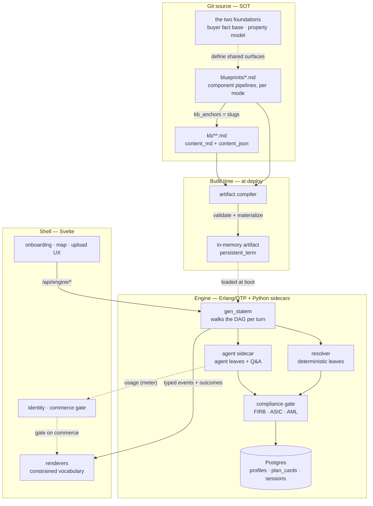
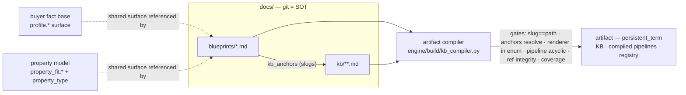
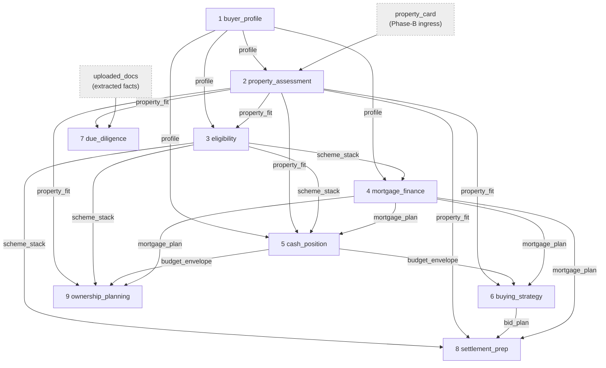
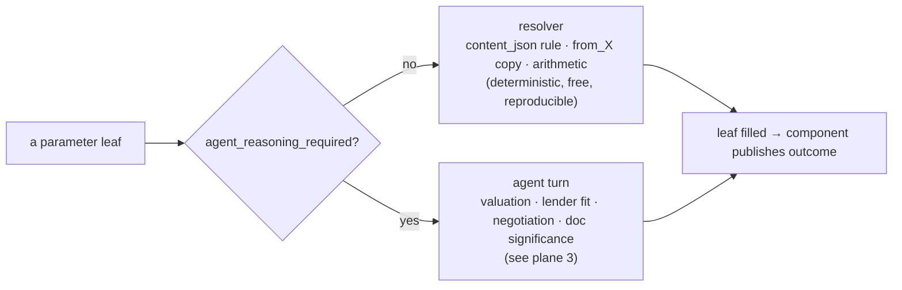
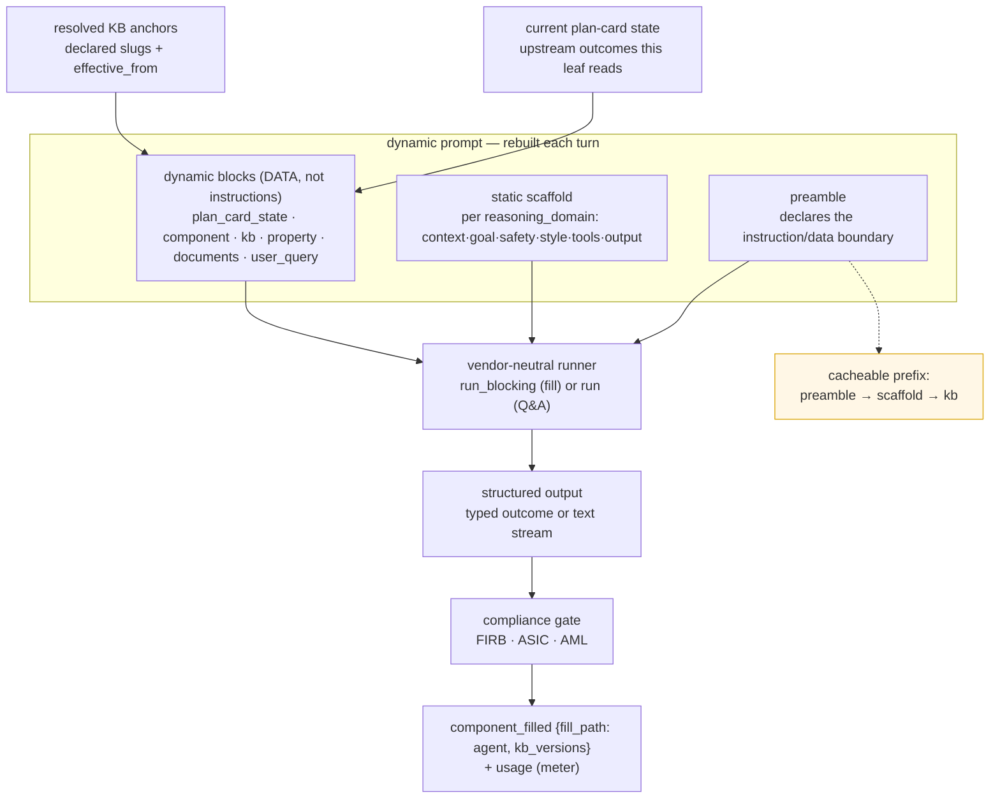
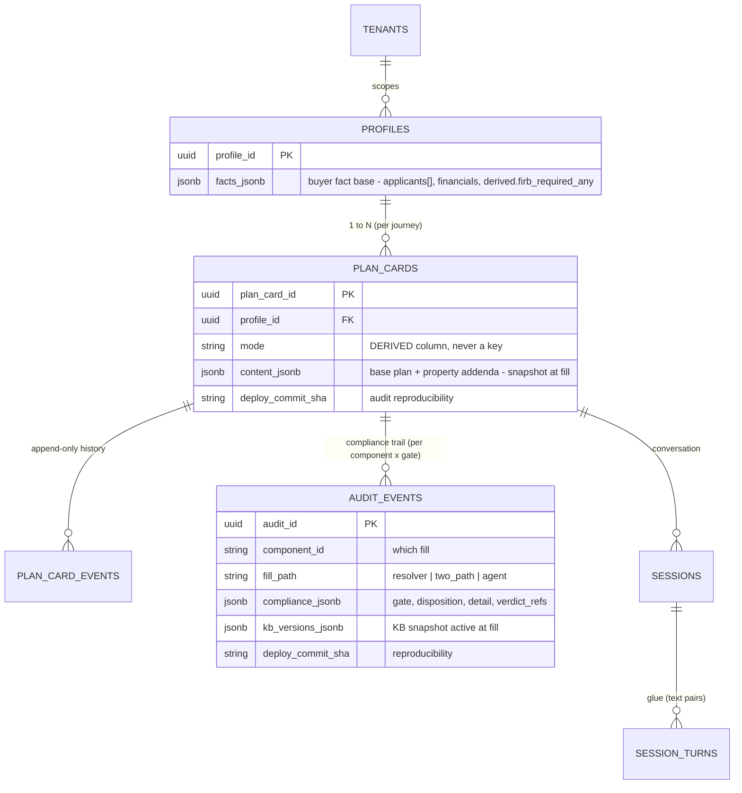
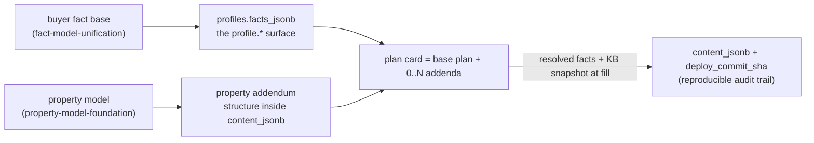
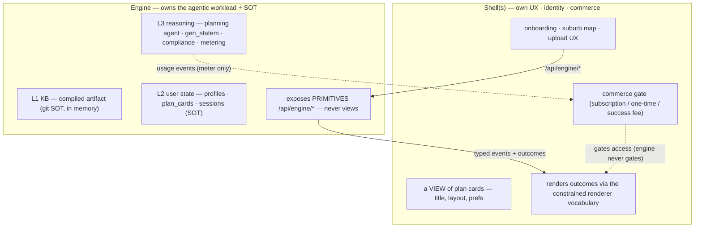

# Structure map — the structures and how they relate

The hub. The system is a small set of **structures** — blueprints, KB docs, the two foundations, the agentic flow, the plan card, profile/plan, renderers, engine/shell — and they connect to each other along **several distinct planes**, not one. This doc is the single coherent place that shows *all the structures and every way they relate*, as diagrams, with each plane pointing into the architecture section that owns its detail. Read this first; follow the cross-links for depth. Detail lives in the owning sections — this doc holds the *map*, not a second copy.

> **The core idea: one node-set, many planes.** The same structures relate differently depending on which question you're asking — *how files become an artifact* (build-time), *how a value flows* (runtime data), *how the agent reasons* (agentic turn), *what persists* (plan card), *what runs where* (engine/shell). Each plane below is one lens over the same nodes.

---

## The structures (the node inventory)

Every structure named in the architecture, in one place, with where its detail lives. Two of these — the **containers** — are the atoms of the data plane; the rest are how those atoms are organised, filled, persisted, and deployed.

| Structure | What it is | Detail |
|---|---|---|
| **blueprint** | an ordered pipeline of components, one per user mode (A/B/C/D) | [§11.9](architecture.md#119-blueprint-as-data-model--presentation-specification) |
| **component** | one numbered step: `goal` / `inputs` / `parameters` / `outcome_schema` / `scope` / `renderer` / `kb_anchors` | [§11.9](architecture.md#119-blueprint-as-data-model--presentation-specification) |
| **parameters** (container) | a component's *scratchpad* — a tree of leaves being filled; never read by anyone else | [§11.9](architecture.md#119-blueprint-as-data-model--presentation-specification) |
| **outcome** (container) | a component's *published facts* — flat, typed; the interface downstream reads | [§11.9](architecture.md#119-blueprint-as-data-model--presentation-specification) |
| **KB doc** | the curated rulebook for one regulated fact: frontmatter + `content_md` (prose) + `content_json` (the `## Rules` block) | [§11.9](architecture.md#119-blueprint-as-data-model--presentation-specification) |
| **content_json** | the filling logic for specific leaves (`fills[]`, `parameters{}`, `stacking{}`) | [§11.9](architecture.md#119-blueprint-as-data-model--presentation-specification) |
| **slug / kb_anchors** | a KB doc's stable address (`slug == path`), and the list of docs a component uses | [§11.9](architecture.md#119-blueprint-as-data-model--presentation-specification) |
| **registry** | the set of fields a rule may read: the union of upstream outcomes + declared external sources | [§11.9](architecture.md#119-blueprint-as-data-model--presentation-specification) · [plane 2](#plane-2--runtime-pipeline-the-data-plane) |
| **buyer fact base** (foundation) | the one mode-independent `profile.*` surface; modes populate a subset | [`fact-model-unification.md`](fact-model-unification.md) |
| **property model** (foundation) | the `property_fit.*` surface, the `property_type` enum, the property-dependent scheme structure | [`property-model-foundation.md`](property-model-foundation.md) |
| **resolver / agent** (fill paths) | the two ways a leaf is filled: deterministic resolver, or an agent turn at `agent_reasoning_required` leaves | [`agentic-boundary.md`](agentic-boundary.md) |
| **suburb data** (reference surface) | the `suburb.*` surface (third registry term) materialized as the `suburbs` table; build-time ABS/SEIFA/state ingestion; `<from_suburb>` session-start lookup | [`suburb-data-foundation.md`](suburb-data-foundation.md) |
| **agentic flow** | agent types, dynamic prompt structure, vendor-neutral run layer, context management | [`agentic-flow.md`](agentic-flow.md) |
| **plan card** | the persistent runtime instance: a base plan + 0..N property addenda | [§11.1](architecture.md#111-the-three-layers) · [`isolation-model.md`](isolation-model.md) |
| **two spines + `cash_events`** (lifecycle model) | the plan card projected onto two axes — legal swimlane (party × phase) · financial calculator (money × phase) — over one shared `cash_events` list; plus the simulate-preview vs save-as-refine rule (exactly one saved scenario) | [`lifecycle-simulation-model.md`](lifecycle-simulation-model.md) |
| **profile / plan / mode** | household fact base (persistent) ⟵ plan (per journey); mode *derived*, never a key | [`fact-model-unification.md`](fact-model-unification.md) |
| **renderer** | a member of the constrained presentation vocabulary that turns an outcome into UI | [§11.9](architecture.md#119-blueprint-as-data-model--presentation-specification) |
| **engine / shell** | the two independently-deployable halves; API is the only contract | [§11.0](architecture.md#110-engine--shell-split-deployable-shape) · [`engine-contract.md`](engine-contract.md) (engine side) · [`shell-architecture.md`](shell-architecture.md) (shell side) |
| **commit-seam compliance** | the two layers every fill crosses at the `fh_engine_turn` commit: **Layer 1** structural outcome-conformance (`localized_text` · §98 figure-type · enum · placement/provenance; fail-closed crash) then **Layer 2** regulated FIRB/ASIC/AML dispositions (`clear`/`annotate`/`branch`/`block`) → one `audit_events` row per (component, gate) | [`outcome-conformance.md`](outcome-conformance.md) · [`compliance-pipeline.md`](compliance-pipeline.md) |

**Outcomes carry facts, not verdicts.** An outcome exposes normalised facts (age, residency, price); the verdict ("FHG-eligible") is produced by the component that *owns the rule*, never pre-baked upstream. This is the invariant the whole data plane rests on.

---

## Plane 0 — the master map

Everything, grouped by where it lives (git source / build / engine / shell). Solid arrows are the live path of a request; dotted arrows are *defines* / *meters* / *gates* relationships that cross the grain.

The forcing line between the two halves: the engine **meters** (emits `usage`) but never **gates** on commerce; shells gate. That keeps both billing and ASIC liability out of the agent loop. The planes below zoom into the busy regions of this map.

---

## Plane 1 — build time (files → artifact)

How git-authored markdown becomes the one in-memory artifact the engine boots from. Runs **once, at deploy**.

Git is the source of truth; the artifact is a deterministic, rebuildable projection of a commit. **KB and blueprints are never Postgres tables.** The two foundations are not files the compiler reads separately — they are the *shape* the blueprints and KB conform to, materialized by the compiler as the registry and validated by its gates. The compiler will not emit until that structure is complete (its emit is currently gated on the property foundation).

Detail: [§11.9](architecture.md#119-blueprint-as-data-model--presentation-specification) (the artifact + gates), [§11.2](architecture.md#112-update-cadences-and-offline-kb-agent-roles) (the offline KB agent that authors + compiles), [`fact-model-unification.md`](fact-model-unification.md) + [`property-model-foundation.md`](property-model-foundation.md) (the two surfaces), [`engine-contract.md`](engine-contract.md) §9.1.

---

## Plane 2 — runtime pipeline (the data plane)

How a value flows when a plan card fills. Components run in **DAG order**; each fills its parameter leaves, then publishes its outcome; the outcomes accumulate into the registry later components read. This is the plane the rest of the system is naming parts of.

*(Mode A's pipeline, acquisition components 1–9. Each arrow is labelled with the **outcome** the downstream component reads — never the upstream parameters. `due_diligence` is parallel to the bidding path. The two grey nodes are external inputs, not components.)*

**The two spines and the shared `cash_events` primitive.** Two further **base-scope projection** components close the pipeline — `purchase_journey` (10) and `preparation` (11). They compute no new figures; they *place* figures the upstream components already own onto the two **spines** of the lifecycle. The financial spine (the `calculator`) and the legal spine (the `swimlane-diagram`) both read **one** shared list — `cash_events` (`{phase, direction, amount, counterparty, source_component}`) — so the two views cannot disagree (one-computer-per-figure extended to *every* consumer, including the client). The DAG constrains where that list can live: `cash_events` is owned by `cash_position` (5) for the phases it can see (Prepare→Settle — the calculator's span), while the whole-lifecycle swimlane is assembled last by `purchase_journey` (10), which alone also reads `ownership_planning`'s (9) Own-phase events. So the calculator legitimately spans fewer phases than the swimlane — by DAG necessity, not omission. Detail: [`lifecycle-simulation-model.md`](lifecycle-simulation-model.md) §2–§3.

**Filling a leaf — the only branch in the system.** Each leaf is filled by exactly one of two paths, statically declared in the blueprint so the engine knows the cost before running:

**The concrete trace — "is this buyer eligible for FHG?"** `eligibility` must fill `eligibility.fhg.eligible`. The rule lives in `docs/kb/scheme/fhg.md` `content_json.fills[]`: a `criteria all_of` over `applicant.citizenship_status in [citizen, permanent_resident]`, `applicant.age gte 18`, the ownership test, `owner_occupier_intent == true`, and `property_fit.price lte <ref: the cap leaf>`. Those reads (`applicant.*`, `property_fit.*`) must resolve against the **registry** = `profile.* ⊕ applicant.* ⊕ property_fit.* ⊕ suburb.*` — i.e. the outcomes published by components 1–2 upstream. The resolver evaluates the criteria → `true/false` → leaf filled → `eligibility` publishes `scheme_stack`.

**Addressing — how a field name points at a fact.** Two namespace kinds, on the two ends of a data edge:

- **read** (`field` / `ref`) — addresses an upstream **outcome** by its canonical slot alias, uniform across modes: `profile.*`, `property_fit.*`, `suburb.*`.
- **fill** (`leaf`) — addresses the **parameter tree** of the component the doc is anchored to: `eligibility.*`, `firb_workflow.eligibility.*`.
- **`applicant.*`** — a registry *projection* of the `profile.applicants` array element. A read in `applicant.*` is evaluated per applicant and AND-ed (the all-applicants test); a `leaf` in `applicant.*` is computed per applicant (a map). The quantifier lives in resolver code, selected by which side the namespace appears on.

The compiler's **reference-integrity gate** checks every read resolves to a real upstream field of compatible type; **coverage** checks every `leaf` lands in a real parameter slot. Detail: [§11.9](architecture.md#119-blueprint-as-data-model--presentation-specification), [`agentic-boundary.md`](agentic-boundary.md) (which leaves clear the agent bar).

---

## Plane 3 — the agentic turn

What happens inside an `agent_reasoning_required` leaf (and a Q&A turn). The orchestration itself is **not** agentic — deterministic code (the `gen_statem` walking the DAG) dispatches the agent only where the rules run out. The agent grounds in **current plan-card state, never conversation history** (constraint #9).

Two properties make this safe and cheap: **card is truth, history is glue** — the filled card is re-injected fresh as grounding every turn; message history is kept only for pronoun resolution, never as grounding. And **one runner, many domain modules** — leaf-fill is stateless (a `valuation` fill and a `lender_fit` fill are as isolated as two pure-function calls), so isolation comes from the run model, not from cloned agents. The `preamble → scaffold → kb` prefix is stable, so it caches across fills and turns.

Detail: [`agentic-flow.md`](agentic-flow.md) (agent types, prompt, vendor layer, context), [`agentic-boundary.md`](agentic-boundary.md) (the resolver/agent decision rule), [`engine-contract.md`](engine-contract.md) §4/§6 (events + the compliance gate); the gate's two layers at the commit seam: [`outcome-conformance.md`](outcome-conformance.md) (Layer 1, structural) · [`compliance-pipeline.md`](compliance-pipeline.md) (Layer 2, regulated).

---

## Plane 4 — persistence (the plan card)

What a filled instance becomes when it is stored, and how the two foundations map onto it. The persistent unit is **not** `(user × mode)` — it is a household **fact base** ⟵ **plans** keyed per purchase journey, with **mode derived** (never a key).

The mapping that ties the foundations to storage:

The discipline that makes this coherent: **structure is built now, data flows later.** The base plan needs zero property data (constraint #1/#2); the property foundation defines the *structure* of an addendum, and a specific property is the *data* that fills it via the narrow Phase-B paths. The buyer foundation settled the *units* (profile/plan); the property foundation completes the *content structure* of one nested part (the addendum) — it introduces no new persistent unit and changes no keys. At each fill, resolved facts + the KB content snapshot into `content_jsonb` with the `deploy_commit_sha`, so the regulated artifact is reproducible.

Beside the plan card itself, every committed fill writes one **`audit_events`** row per (component, gate) — the regulated compliance trail (FIRB/ASIC/AML disposition + the consumed Layer-1 verdict + the KB snapshot + the deploy SHA), written even on a `clear`. It is attribution, not cost (no token/price fields ever — metering is the `usage` event stream).

**Simulation persists nothing until Save.** A structural what-if is a non-persisting `simulate` **preview** — it writes no `content_jsonb`, no `plan_card_events`, no cursor advance, no `usage` — so it is exempt from per-card serialization and cannot race the snapshot. **Save** is an ordinary resolver-only **refine turn** that advances the card's *single* current snapshot (there is no scenarios table and no fork; history lives in the append-only event log). A card therefore always holds exactly one saved scenario, audit-reproducible like any other fill. Detail: [`lifecycle-simulation-model.md`](lifecycle-simulation-model.md) §4, [`engine-contract.md`](engine-contract.md) §10.

Detail: [`fact-model-unification.md`](fact-model-unification.md) (the profile/plan/mode decision), [`property-model-foundation.md`](property-model-foundation.md) (the addendum structure), [`engine-contract.md`](engine-contract.md) §9.1 (the schema), [`isolation-model.md`](isolation-model.md) (plan card vs turn, per-card serialization), [`compliance-pipeline.md`](compliance-pipeline.md) §5 (the audit trail) · [`outcome-conformance.md`](outcome-conformance.md) (the Layer-1 verdict it records).

---

## Plane 5 — engine / shell ownership

What runs where, and who owns each structure. Two independently-deployable halves; the API is the only contract. The split is forced by a single rule: **if two shells would render the same data differently, it is shell-owned and the engine must not shape it.**

The two things the engine deliberately keeps and keeps *out*: **compliance** (FIRB/ASIC/AML) is a gate on agent behaviour → engine-owned and structural (constraint #10), not a shell disclaimer; **commerce** is shell-owned, so the engine only meters — keeping billing *and* ASIC liability out of the agent loop. Detail: [§11.0](architecture.md#110-engine--shell-split-deployable-shape), [`engine-contract.md`](engine-contract.md) (the boundary from the engine side), [`shell-architecture.md`](shell-architecture.md) (what sits behind the shell edge — two-JWT, backend modules, shell DB), [`billing.md`](billing.md) (the commerce mechanism — tiered subscription, metering→billing outbox, measured cost basis, Stripe), [`principles.md`](principles.md).

---

## Map ↔ architecture index

The hub is navigable both ways: from a plane to its detail, and from an architecture section to the plane that pictures it.

| Plane | Pictures | Detailed in |
|---|---|---|
| 0 master map | all structures, all halves | this doc |
| 1 build time | files → compiler → artifact | [§11.9](architecture.md#119-blueprint-as-data-model--presentation-specification), [§11.2](architecture.md#112-update-cadences-and-offline-kb-agent-roles), foundations |
| 2 runtime pipeline | component DAG · params→outcome→registry · fill-path · two spines + `cash_events` | [§11.9](architecture.md#119-blueprint-as-data-model--presentation-specification), [`agentic-boundary.md`](agentic-boundary.md), [`lifecycle-simulation-model.md`](lifecycle-simulation-model.md) |
| 3 agentic turn | prompt → runner → output → gate | [`agentic-flow.md`](agentic-flow.md), [`agentic-boundary.md`](agentic-boundary.md) |
| 4 persistence | profile ⟵ plan_cards · addendum structure · snapshot · simulate-preview vs save | [`engine-contract.md`](engine-contract.md) §9.1, [`isolation-model.md`](isolation-model.md), [`lifecycle-simulation-model.md`](lifecycle-simulation-model.md), foundations |
| 5 engine/shell | what runs where · meter vs gate · commerce | [§11.0](architecture.md#110-engine--shell-split-deployable-shape), [`engine-contract.md`](engine-contract.md), [`shell-architecture.md`](shell-architecture.md), [`billing.md`](billing.md) |
